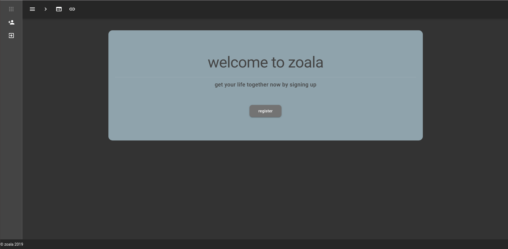
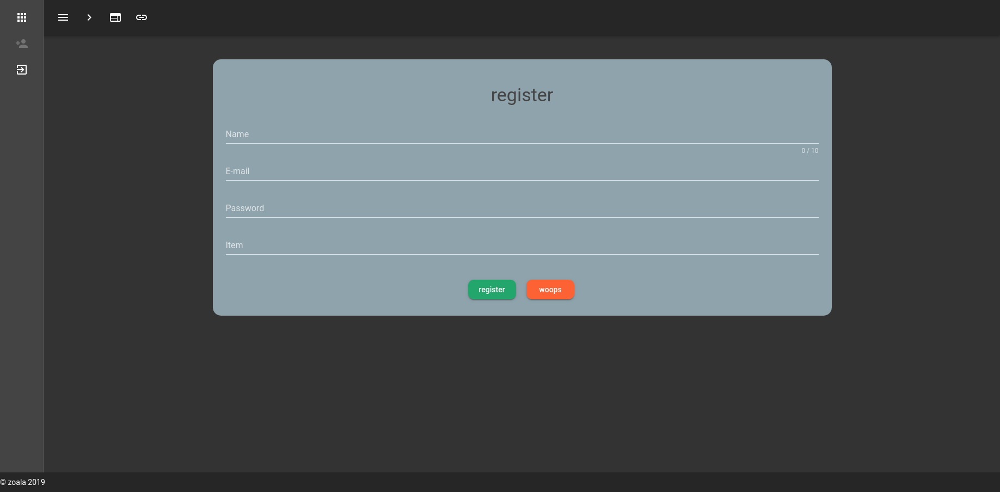
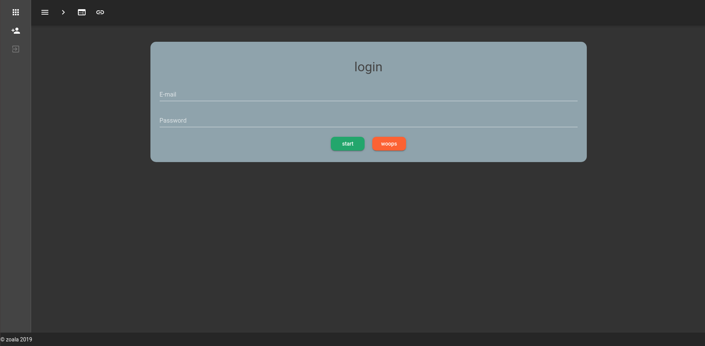
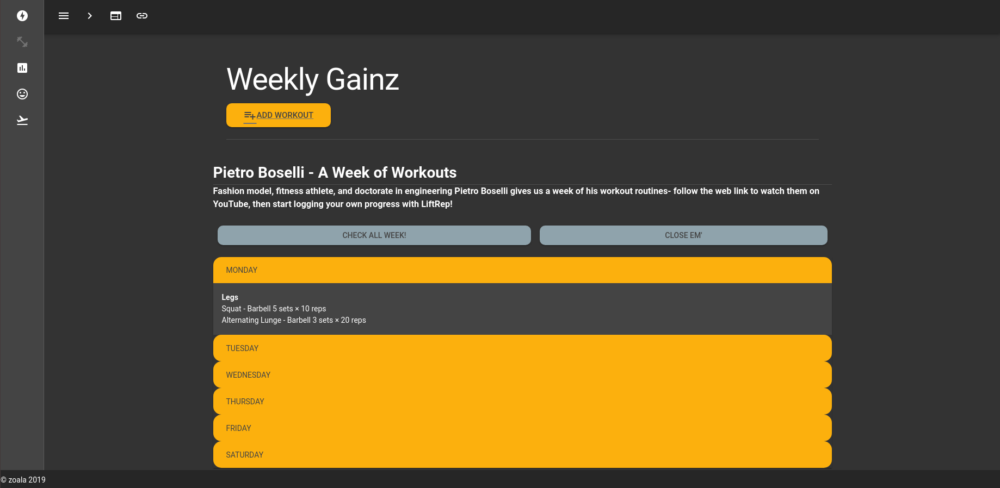
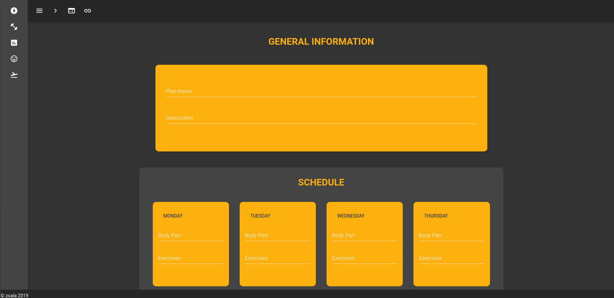
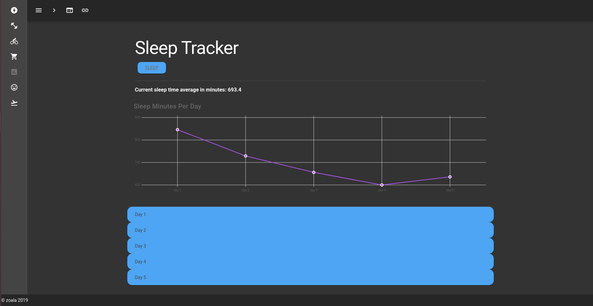
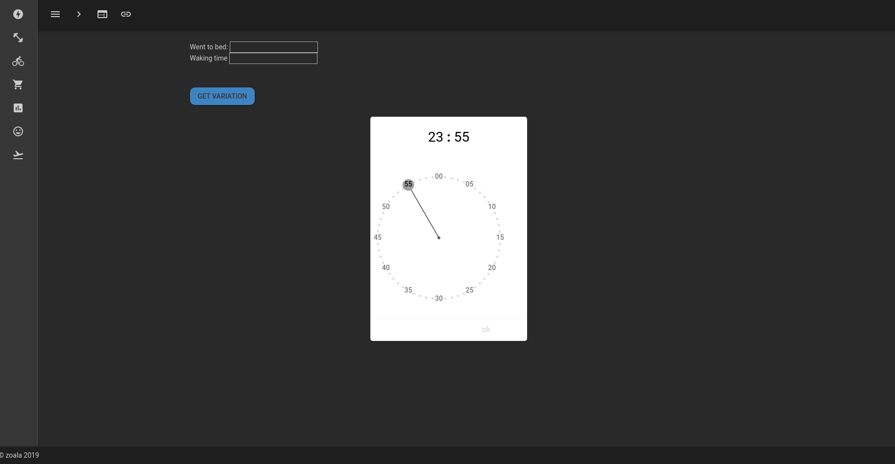

# zoala-nuxtjs

> Nuxtjs Vue Vuex Vuetify Frontend

# Demo Images 
#### (For demo purposes the RestAPI-Auth-zoala repo's backend is used)










## There's more features to come!!
### Coming up(sleep, cardio, food, etc.)
## Build Setup

``` bash
# install dependencies
$ npm run install

# serve with hot reload at localhost:3000
$ npm run dev

# build for production and launch server
$ npm run build
$ npm run start

# generate static project
$ npm run generate
```

For detailed explanation on how things work, checkout [Nuxt.js docs](https://nuxtjs.org).
